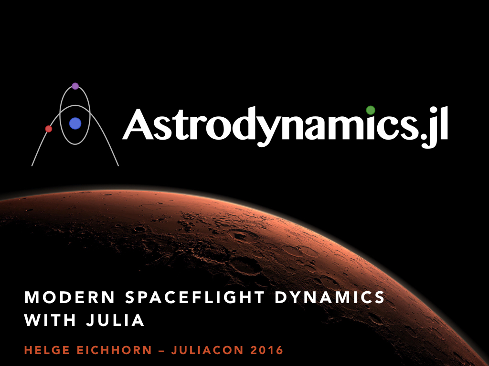

The talk on [YouTube](https://www.youtube.com/watch?v=IjJqVwtWO3s).

* [Dopri.jl](https://github.com/helgee/Dopri.jl)
* [JPLEphemeris.jl](https://github.com/helgee/JPLEphemeris.jl)
* [Astrodynamics.jl](https://github.com/helgee/Astrodynamics.jl)

The visualization of the Solar System was done with [Cosmographia](http://naif.jpl.nasa.gov/naif/cosmographia.html).
